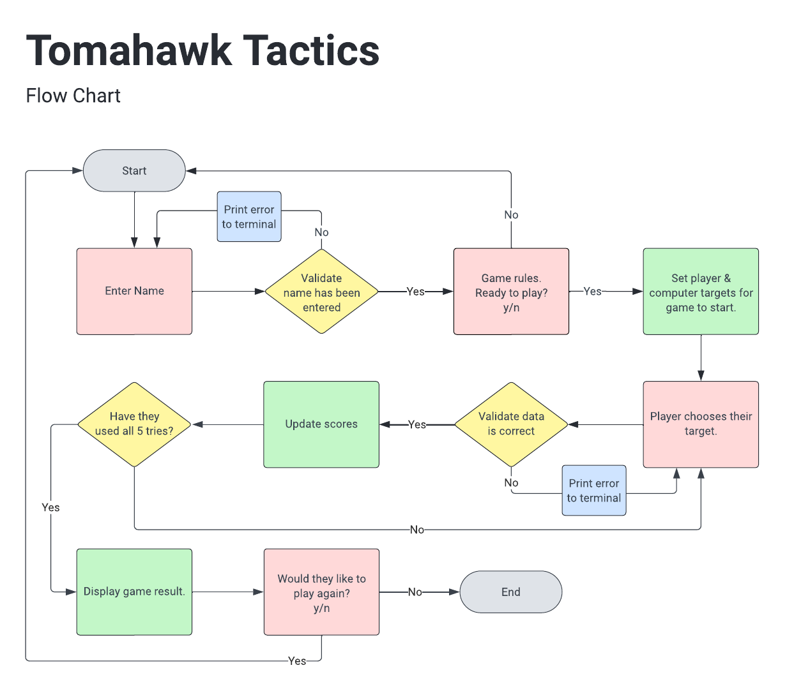

# TOMAHAWK TACTICS

Welcome to Tomahawk Tactics, an interactive command-line game powered by Python. 

Based on the classic game of BattleShips, this game uses axe throwing as the challenge, attempting to hit a 'moving' target. The user gets 5 attempts to hit 3 targets.

LIVE SITE

[You can view the live site here, which is best viewed on a desktop.](https:///)

GITHUB PAGES

[You can view the GitHub code pages here.](https://github.com/rachaelbabister/tomahawk-tactics)

---
## CONTENTS
<!-- TOC -->

- [TOMAHAWK TACTICS](#tomahawk-tactics)
    - [CONTENTS](#contents)
    - [User Experience UX](#user-experience-ux)
        - [Client Goals](#client-goals)
        - [Visitor Goals](#visitor-goals)
    - [Design](#design)
        - [Flow Chart](#flow-chart)
    - [Features](#features)
        - [Features need to go here](#features-need-to-go-here)
        - [Future Implementations](#future-implementations)
    - [Technologies Used](#technologies-used)
        - [Languages Used](#languages-used)
        - [Frameworks, Libraries & Programs Used](#frameworks-libraries--programs-used)
        - [Deployment](#deployment)
        - [Local Development](#local-development)
            - [How to Fork](#how-to-fork)
            - [How to Clone](#how-to-clone)
    - [Testing](#testing)
        - [Validator Testing](#validator-testing)
        - [Manual Testing](#manual-testing)
    - [Credits](#credits)
        - [Code Used](#code-used)
        - [Content](#content)
        - [Inspiration for the Game](#inspiration-for-the-game)

<!-- /TOC -->

---

## User Experience (UX)

### Client Goals

- An axe throwing logical game, whereby the players have to 'throw' their axe to hit a moving target.
- It will be played on grids where the targets are marked.
- The locations of the targets need to be concealed from the other player.
- Players take their turns to 'throw' their axe, with the objective being they need to make contact with the target.
- The player who hits the most targets first, wins.
- Players will compete against the computer.

### Visitor Goals

- I would like to play an online logical game.
- I would like to compete against the computer.
- I don't want the game so long that I get bored.
- I want to know who won at the end of the game.
- I would like the option to play again.

---

## Design

### Flow Chart

To help get a better understanding before I started writing the code for this game, I created a flow chart within [Lucid](https://lucid.app/).

---

## Features

The game is an interactive command-line game, created using Python and deployed within Heruko.

### Features need to go here

--
### Future Implementations

- At the beginning of the game, the player would have the option to choose their grid size. Depending on the size, this would affect the number of targets and axe throws they get.
- It would be good to introduce some colour to the game, both with the 'logo' and also on the targets to make it visually clear when you have hit it.
- To have the options of playing single, 2 players, or against the computer.

---

## Technologies Used

### Languages Used

Python was used to create this interactive command-line game.

--
### Frameworks, Libraries & Programs Used

- [Lucid](https://lucid.app/) - to create Flow Charts.
- [Codeanywhere](https://app.codeanywhere.com/) - cross-platform cloud IDE to deploy workspace environment to Github.
- [Github](https://github.com/) - to store and display all files and assets for the project.
- [Heroku](https://heroku.com/) - to deploy and host the logical game.

--
### Deployment

The game was written within CodeAnywhere, committed to GitHub to store as a local repository, and then deployed to Heroku. To deploy on Heroku, follow these steps:

1. Log in to Heroku - or set up a new account.
2. From the dashboard, click 'Create new app'.
3. Name your app - it will need to be unique. Select Region, then 'Create'.
4. Click on the 'Settings' tab.
5. Scroll down to Config Vars and click 'Reveal Config Vars'.
6. In the 'Key' field enter 'PORT', and in the 'Value' field enter '8000'.
7. If there is a credentials file, this will also need to be entered into the Config Vars setting.
8. Staying within 'Settings', scroll down to Buildpacks and click on 'Add Buildpacks'.
9. Select 'python' first and click 'Save changes'.
10. Then do the same again and this time select 'nodejs' and click 'Save changes'.
11. Ensure the buildpacks are in the order of python first and nodejs second. 
12. Scroll to the top and select 'Deploy'.
13. In 'Deployment method' select 'GitHub' and confirm you want to connect.
14. Enter your GitHub repository into the search bar, and then 'Connect'.
15. Under 'Automatic deploys', click on 'Enable Automatic Deploys' if you want the app to update every time you push changes to GitHub.
16. Finally, click on 'Deploy Branch' under 'Manual deploy' to deploy your app. Once completed, you will be able to view your deployed link.

--
### Local Development

#### How to Fork

To fork a repository on Github, follow these steps:

1. Log in to Github - or step up a new account.
2. Find the repository that you would like to fork.
3. Click the Fork button in the top right corner (below where 'Settings' is).

#### How to Clone

To clone a repository on Github, follow these steps:

1. Log in to Github - or step up a new account.
2. Find the repository you would like to fork.
3. Click on the code button, select whether you would like to clone with HTTPS, SSH or GitHub CLI and copy the link shown.
4. Open the terminal in your code editor and change the current working directory to the location you want to use for the cloned directory.
5. Type 'git clone' into the terminal and paste the link you copied in step 3. Press enter.

---

## Testing

### Validator Testing

--
### Manual Testing

| Feature | Expected Action | Test Result |
| --- | --- | --- |

---

---

## Credits

### Code Used

- [Ask Python](https://www.askpython.com/python-modules/ascii-art) - helped to create the title of the game in ASCII art.
- [Scaler.com](https://www.scaler.com/topics/how-to-clear-screen-in-python/) - helped with the code to clears the console.
- [Geeks for Geeks](https://www.geeksforgeeks.org/how-to-add-time-delay-in-python/) - helped with the code for adding a time delay.
- [Stack Overflow](https://stackoverflow.com/) - my ReadMe file for some reason wasn't automatically updating my contents menu. Looked on Slack for help and advice and eventually installed 'toc'.
- [Stack Overflow](https://stackoverflow.com/questions/34980251/how-to-print-multiple-lines-of-text-with-python) - how to print multiple lines of text in Python.
- [Slack Community](https://app.slack.com/) - just general advice on the Slack Community.
- [Code Institute](https://learn.codeinstitute.net/ci_program/diplomainfullstacksoftwarecommoncurriculum) - for help in reminding me how to deploy in Heroku and going back on previous python lessons.

--
### Content

Introduction and game rules written by Rachael Babister.

--
### Inspiration for the Game

Battleships is very much a game I remember from my childhood, playing with my brother on a little plastic game that attached back-to-back so we could see each other's ships, with little pegs popped in where we guessed! I wanted to base my game around this, however having recently been axe throwing and enjoying the activity immensely, I decided to name the game around this theme, with the idea that you are throwing an axe at the target. The 'real-life' game doesn't have moving targets like this game suggests, however, because the user was inputting coordinates rather than aiming for the bullseye, I went with this idea.