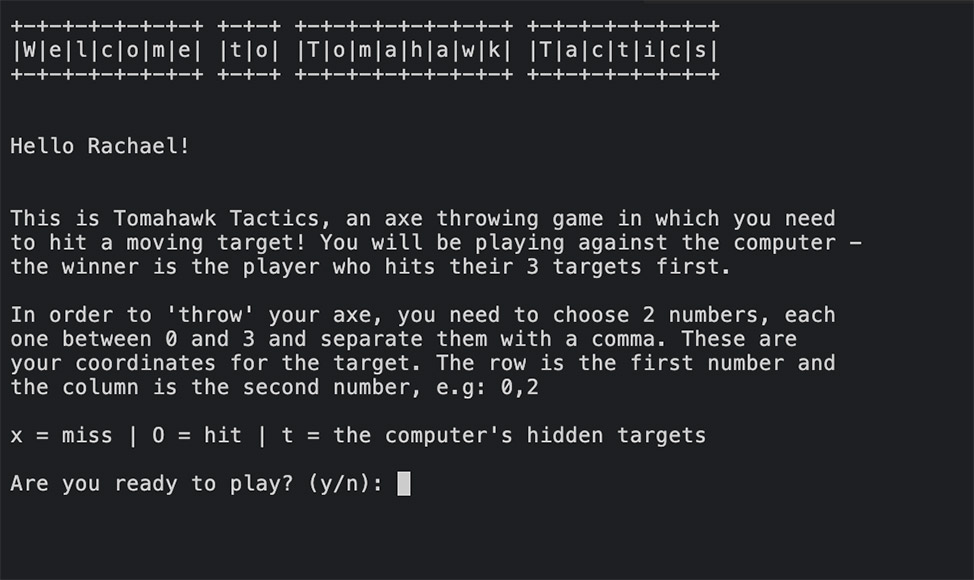
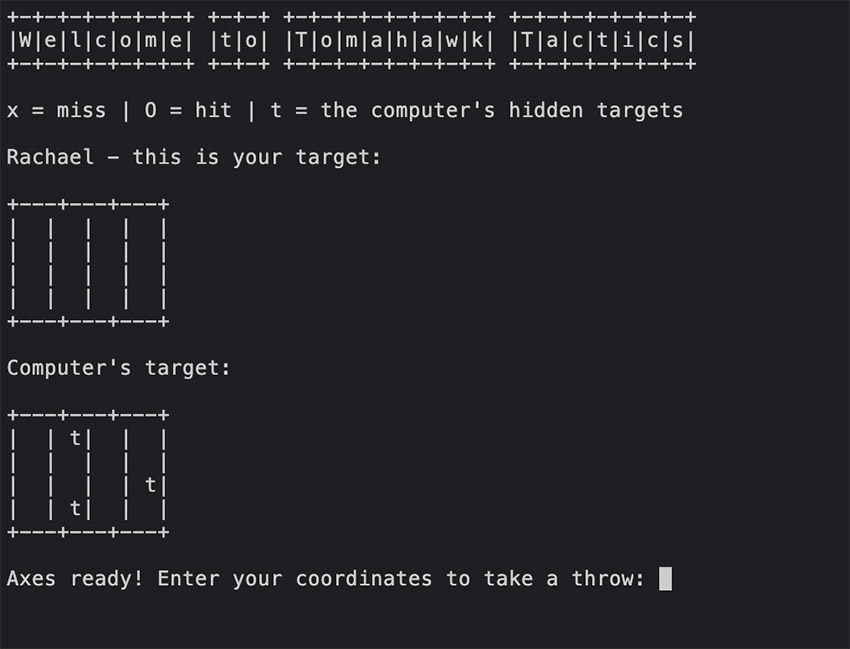
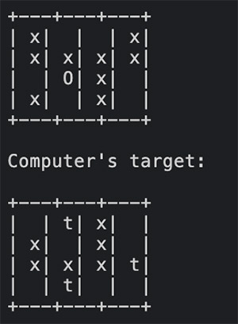
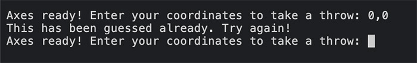
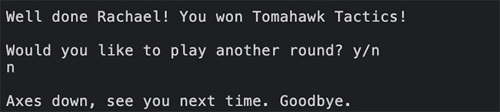

# TOMAHAWK TACTICS

Welcome to Tomahawk Tactics, an interactive command-line game powered by Python. 

Based on the classic game of BattleShips, this game uses axe throwing as the challenge, attempting to hit a 'moving' target. Users play against the computer, each taking a turn until someone hits all 3 targets and becomes the winner!

LIVE SITE

[You can view the live site here, which is best viewed on a desktop.](https:///)

GITHUB PAGES

[You can view the GitHub code pages here.](https://github.com/rachaelbabister/tomahawk-tactics)

---
## CONTENTS
<!-- TOC -->

- [TOMAHAWK TACTICS](#tomahawk-tactics)
    - [CONTENTS](#contents)
    - [User Experience UX](#user-experience-ux)
        - [Client Goals](#client-goals)
        - [Visitor Goals](#visitor-goals)
    - [Design](#design)
        - [Flow Chart](#flow-chart)
    - [Features](#features)
        - [Current Features](#current-features)
        - [Future Implementations](#future-implementations)
    - [Technologies Used](#technologies-used)
        - [Languages Used](#languages-used)
        - [Frameworks, Libraries & Programs Used](#frameworks-libraries--programs-used)
        - [Deployment](#deployment)
        - [Local Development](#local-development)
            - [How to Fork](#how-to-fork)
            - [How to Clone](#how-to-clone)
    - [Testing](#testing)
        - [Validator Testing](#validator-testing)
        - [Manual Testing](#manual-testing)
    - [Credits](#credits)
        - [Code Used](#code-used)
        - [Content](#content)
        - [Inspiration for the Game](#inspiration-for-the-game)

<!-- /TOC -->

---

## User Experience (UX)

### Client Goals

- An axe throwing logical game, whereby the players have to 'throw' their axe to hit a moving target.
- It will be played on grids where the targets are marked.
- The locations of the targets need to be concealed from the other player.
- Players take their turns to 'throw' their axe, with the objective being they need to make contact with the target.
- The player who hits the most targets first, wins.
- Players will compete against the computer.

### Visitor Goals

- I would like to play an online logical game.
- I would like to compete against the computer.
- I don't want the game to go on so long that I get bored.
- I want to know who won at the end of the game.
- I would like the option to play again.

---

## Design

### Flow Chart

To help get a better understanding before I started writing the code for this game, I created a flow chart within [Lucid](https://lucid.app/).

---

## Features

The game is an interactive command-line game, written in Python and deployed within Heroku.

### Current Features

- Title page 

    The 'home page' in effect, with the name of the game using ASCII art to create the main title, and also the 'welcome' subtitle. There is the illusion of the "Game Loading..." which is executed with a 3 second delay, to allow the user to read the title. It then asks the user to enter their name.

    

- Welcome and Game Rules

    A welcome subtitle to remind the user the name of the game. A personal hello message to the user, and then a brief explanation of the game and the rules. The user then selects y/n if they want to play.

    

- Building Targets

    After stating y to play the game, a delay is set with the print statement 'Getting targets ready...' to give the illusion it is building the targets. 

     

- Target Boards

    The console is cleared, to give a clearer display for the user. The subtitle stays at the top, a reminder of the key for the game, and then 2 boards - one for the user and the other for computer. The user is able to see where the computer needs to try and hit, but their own is hidden. The user needs to enter a 2 number coordinate to take their throw.

    

- Hit or Miss on the Board

    As detailed by the key above the boards, the user is able to see whether they have hit the target by the use of an 'O', or missed by the use of an 'x'. The 't' on the computer's target board indicates where the computer needs to hit.

        

- Error Messages

    There are 2 possible error messages that could appear, from the users coordinates. One would be if they put in 2 numbers that aren't on the grid. The other is if they have already guessed those numbers.

    
    
    

- Winning the Game

    The winner is the player who correctly guesses the 3 hits on target first. There is a different message for if the user wins, or the computer wins. There is an option to play again. If the user says 'y', they get taken back to the rules and if they are ready to play.

    

    
    
- Ending the Game

    On two occasions the user gets asked if they are ready to play, and if they want to play again. If they choose 'n' at these points, the game ends and they get a goodbye message.

    
    
    

--
### Future Implementations

- At the beginning of the game, the player would have the option to choose their grid size. Depending on the size, this would affect the number of targets and axe throws they get.
- It would be good to introduce some colour to the game, both with the 'logo' and also on the targets to make it visually clear when you have hit it.
- To have the options of playing single, 2 players, or against the computer.

---

## Technologies Used

### Languages Used

Python was used to create this interactive command-line game.

--
### Frameworks, Libraries & Programs Used

- [Lucid](https://lucid.app/) - to create Flow Charts.
- [Codeanywhere](https://app.codeanywhere.com/) - cross-platform cloud IDE to deploy workspace environment to Github.
- [Github](https://github.com/) - to store and display all files and assets for the project.
- [Heroku](https://heroku.com/) - to deploy and host the logical game.

--
### Deployment

The game was written within CodeAnywhere, committed to GitHub to store as a local repository, and then deployed to Heroku. To deploy on Heroku, follow these steps:

1. Log in to Heroku - or set up a new account.
2. From the dashboard, click 'Create new app'.
3. Name your app - it will need to be unique. Select Region, then 'Create'.
4. Click on the 'Settings' tab.
5. Scroll down to Config Vars and click 'Reveal Config Vars'.
6. In the 'Key' field enter 'PORT', and in the 'Value' field enter '8000'.
7. If there is a credentials file, this will also need to be entered into the Config Vars setting.
8. Staying within 'Settings', scroll down to Buildpacks and click on 'Add Buildpacks'.
9. Select 'python' first and click 'Save changes'.
10. Then do the same again and this time select 'nodejs' and click 'Save changes'.
11. Ensure the buildpacks are in the order of python first and nodejs second. 
12. Scroll to the top and select 'Deploy'.
13. In 'Deployment method' select 'GitHub' and confirm you want to connect.
14. Enter your GitHub repository into the search bar, and then 'Connect'.
15. Under 'Automatic deploys', click on 'Enable Automatic Deploys' if you want the app to update every time you push changes to GitHub.
16. Finally, click on 'Deploy Branch' under 'Manual deploy' to deploy your app. Once completed, you will be able to view your deployed link.

--
### Local Development

#### How to Fork

To fork a repository on Github, follow these steps:

1. Log in to Github - or step up a new account.
2. Find the repository that you would like to fork.
3. Click the Fork button in the top right corner (below where 'Settings' is).

#### How to Clone

To clone a repository on Github, follow these steps:

1. Log in to Github - or step up a new account.
2. Find the repository you would like to fork.
3. Click on the code button, select whether you would like to clone with HTTPS, SSH or GitHub CLI and copy the link shown.
4. Open the terminal in your code editor and change the current working directory to the location you want to use for the cloned directory.
5. Type 'git clone' into the terminal and paste the link you copied in step 3. Press enter.

---

## Testing

### Validator Testing

**PEP8 Linter Validator**

The PEP8 Linter validator initially came back with quite a few errors, however these were mainly too many blank lines and whitespace. Once these were all fixed, the validator came back with no errors.
 

Click to see error messages

    - 31: E501 line too long (86 > 79 characters)
    - 42: E303 too many blank lines (2)
    - 50: W291 trailing whitespace
    - 57: W293 blank line contains whitespace
    - 58: E501 line too long (80 > 79 characters)
    - 59: W293 blank line contains whitespace
    - 62: W293 blank line contains whitespace
    - 66: E303 too many blank lines (2)
    - 69: W291 trailing whitespace
    - 75: E303 too many blank lines (2)
    - 85: E303 too many blank lines (2)
    - 97: E303 too many blank lines (2)
    - 104: E303 too many blank lines (2)
    - 114: E303 too many blank lines (2)
    - 118: W291 trailing whitespace
    - 121: E303 too many blank lines (2)
    - 131: W291 trailing whitespace
    - 134: E303 too many blank lines (2)
    - 139: W293 blank line contains whitespace
    - 151: E303 too many blank lines (2)
    - 161: W291 trailing whitespace
    - 167: E501 line too long (82 > 79 characters)
    - 176: W291 trailing whitespace
    - 187: E251 unexpected spaces around keyword / parameter equals
    - 187: E251 unexpected spaces around keyword / parameter equals
    - 187: E501 line too long (90 > 79 characters)
    - 201: W291 trailing whitespace
    - 202: W291 trailing whitespace
    - 207: E501 line too long (81 > 79 characters)
    - 210: W291 trailing whitespace
    - 211: W291 trailing whitespace
    - 215: E501 line too long (82 > 79 characters)
    - 223: E303 too many blank lines (2)
    - 224: E301 expected 1 blank line, found 0
    - 229: W291 trailing whitespace
    - 230: E251 unexpected spaces around keyword / parameter equals
    - 230: E251 unexpected spaces around keyword / parameter equals
    - 230: E501 line too long (89 > 79 characters)
    - 230: W291 trailing whitespace
    - 249: E251 unexpected spaces around keyword / parameter equals
    - 249: E251 unexpected spaces around keyword / parameter equals
    - 249: E501 line too long (90 > 79 characters)
    - 254: W291 trailing whitespace
    - 257: W291 trailing whitespace
    - 262: W291 trailing whitespace
    - 272: E501 line too long (86 > 79 characters)
    - 275: W291 trailing whitespace

--
### Manual Testing

Whilst manually testing the game and playing it for a few times, I found a few bugs that required fixing, plus also some tweaks to the way the game ran.

- When entering your name, the rules appeared, but the question asking if they wanted to play did not. Within the 'run_game' function, I moved the last while statement to appear underneath the print statement 'Get your axe ready'.

- The function 'unique_throw' had the wrong references. Amended these to self.direct_hit and self.missed_hit.

- Missed out a function to parse the user's throw to be a tuple of int. The function added was 'parse_throw_axe'.

- In the 'throw_axe' function, I moved the input ('Axes ready..') in to the while loop within the argument.

- In the while loop in 'show_targets' function, I changed the if statements from 'computer_throw.game_over' to 'computer_target.game_over' and the same with the user underneath, to fix the 'tuple has no attribute game_over' error.

- Whilst playing the game, I realised the print message “Throw your first axe!” appears on each throw. Amended this to read “Axes ready!”.

- I wanted to clear the console after each throw, to provide a cleaner display for the user, so added clear() to the show_targets function.

- Now having played the game, the instructions are not quite clear enough. These have been updated to explain better about the target boards, and I have also amended it so that you continue playing until someone wins, rather than only getting 5 throws.

- It was also confusing as to which target board was yours, so I switched them around. For this game, rather than trying to hit your opponent's board, you are trying to get the axes into your own.

- It wasn't clear what symbol was a hit and what was a miss, so these have been updated and a key provided.

- Sometimes when a new game was started, there would only be 2 random hit positions. To fix this, I added the following code to the while loop to ensure the lists are cleared after each game iteration:

    user_target.direct_hit = [ ]
    
    user_target.missed_hit = [ ]

- Added in a couple of print statements to the 'show_targets' function so that the Welcome title and the game rules key shows each time the console clears and the user has another throw.

- Removed the print statement 'Thank you for playing...' in the run_game function, as it wasn't really needed.

---

## Credits

### Code Used

- [Ask Python](https://www.askpython.com/python-modules/ascii-art) - helped to create the title of the game in ASCII art.
- [Scaler.com](https://www.scaler.com/topics/how-to-clear-screen-in-python/) - helped with the code to clears the console.
- [Geeks for Geeks](https://www.geeksforgeeks.org/how-to-add-time-delay-in-python/) - helped with the code for adding a time delay.
- [Stack Overflow](https://stackoverflow.com/) - my ReadMe file for some reason wasn't automatically updating my contents menu. Looked on Slack for help and advice and eventually installed 'toc'.
- [Stack Overflow](https://stackoverflow.com/questions/34980251/how-to-print-multiple-lines-of-text-with-python) - how to print multiple lines of text in Python.
- [Slack Community](https://app.slack.com/) - just general advice on the Slack Community.
- [Code Institute](https://learn.codeinstitute.net/ci_program/diplomainfullstacksoftwarecommoncurriculum) - for help in reminding me how to deploy in Heroku and going back on previous python lessons.

--
### Content

Introduction and game rules written by Rachael Babister.

--
### Inspiration for the Game

Battleships is very much a game I remember from my childhood, playing with my brother on a little plastic game that attached back-to-back so we could see each other's ships, with little pegs popped in where we guessed! I wanted to base my game around this, however having recently been axe throwing and enjoying the activity immensely, I decided to name the game around this theme, with the idea that you are throwing an axe at the target. The 'real-life' game doesn't have moving targets like this game suggests, however, because the user was inputting coordinates rather than aiming for the bullseye, I went with this idea.